All Trades Calculator Pro
Professional cross-platform trade calculations for contractors, electricians, plumbers, welders, carpenters, mechanical technicians and builders.

Platforms
✅ Android

✅ iOS

✅ Windows Desktop

Features

32 Trade Calculators
7 Trade Categories
PDF Job Sheets
Imperial & Metric Support
English, Spanish & Chinese
Dark & Light Themes
Offline Operation
Calculation History
Native Share Support

Screenshots

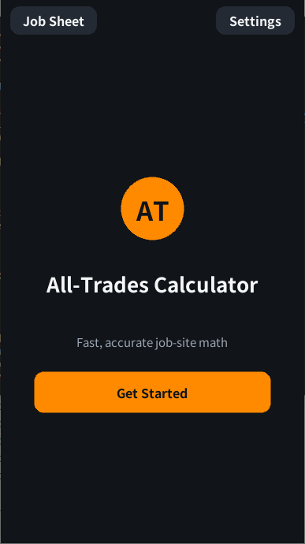 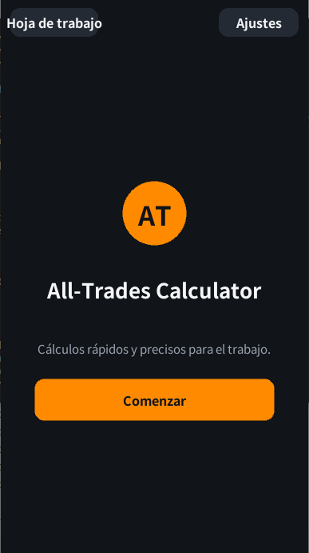 

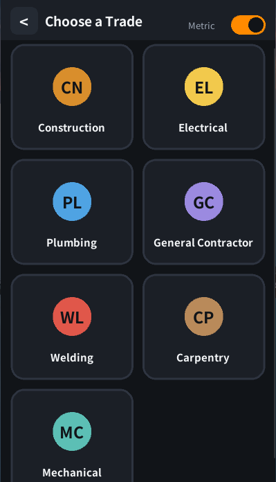

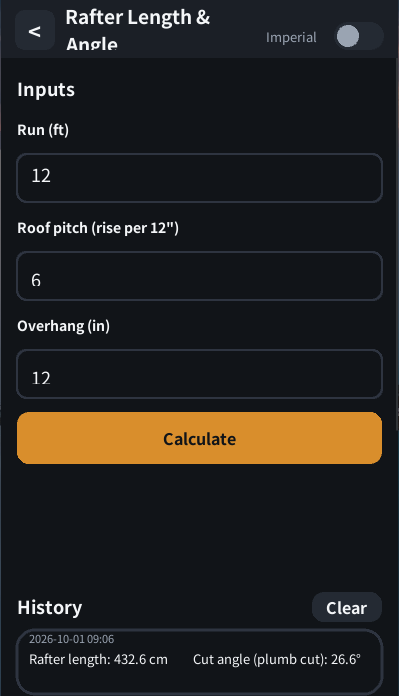

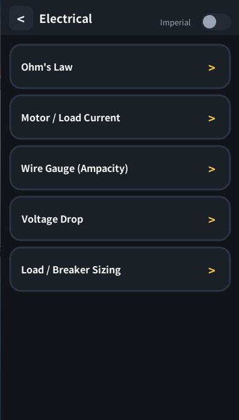

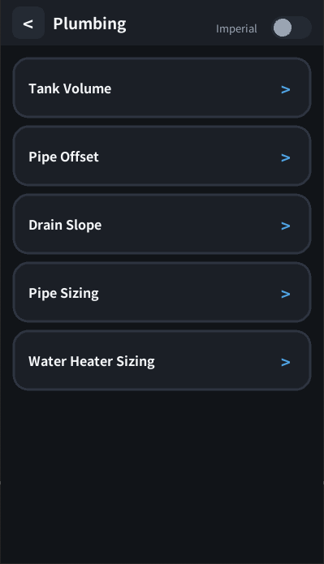

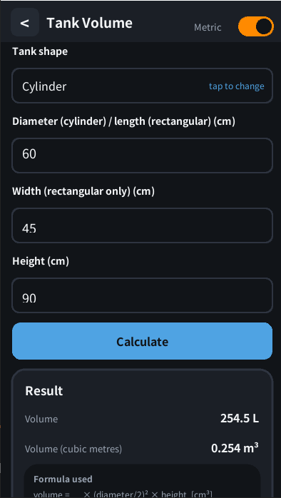

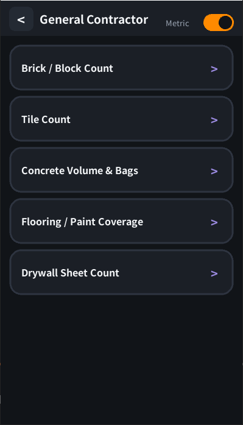

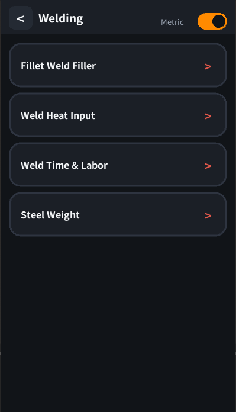

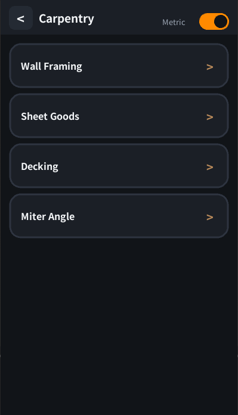

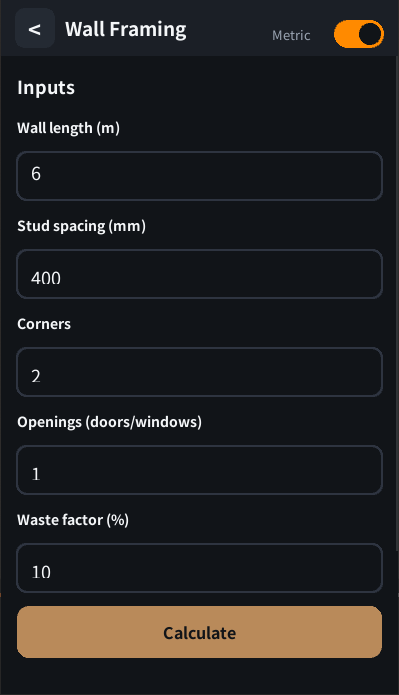

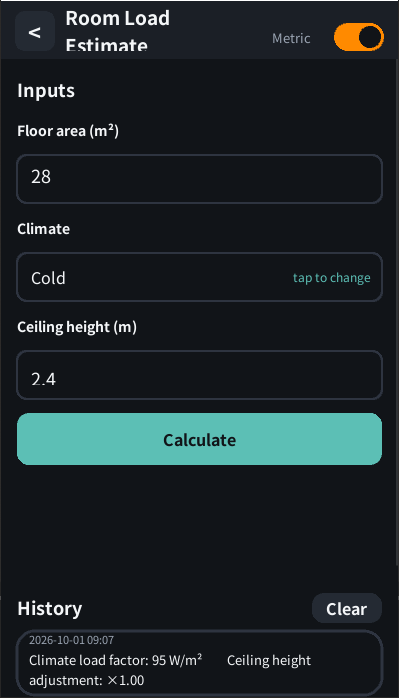

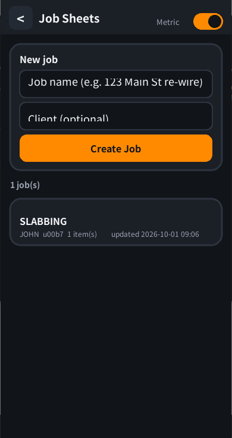

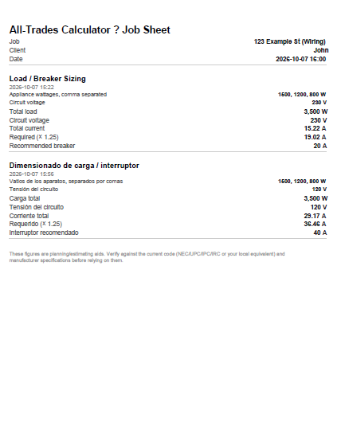

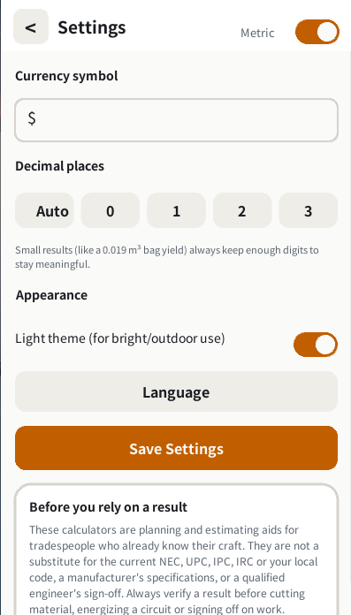

Technology
Python
Kivy
Buildozer
kivy-ios
Data Privacy
All user data remains on-device.

No cloud infrastructure required.